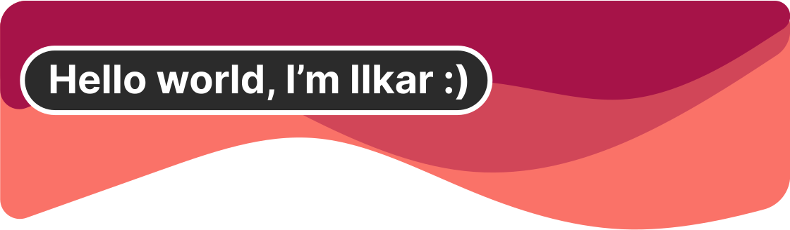
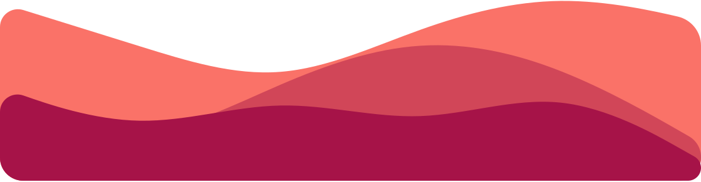

# 🔥 About me 
*   🌍  I'm based in Saint-Petersberg
*   ✉️  You can contact me at my  
*   🧠  I'm learning Java with SpringBoot
*   🤝  I'm open to collaborating on anything
*   ⚡  I'm a secret magician! And I'm IN LOVE WITH FIRE 🔥🔥🔥
  
# 💻 Tech Stack:

<!--    -->
<!--    -->
  
<!--    -->
  
<!--    -->
<!--    -->
  
  
<!--    -->
  

### I'm also interested in 
                    
# 📊 GitHub Stats:
 
 

## 🏆 GitHub Trophies

## 💰 You can help me by Donating
 please in RL ;) 

