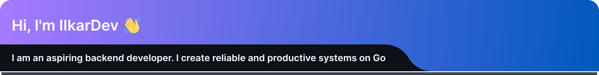

- 🔭 **I'm currently wroking on:** [**Notibot**](https://github.com/IIkarDev/Notibot) — an universal webhook handler for notification centralization. This is my main project, in which I delve into system architecture, working with databases and CI/CD.
  
- 🌱 **Key technologies in my stack:**
  `Go` `PostgreSQL` `Docker` `Gin/Echo` `gRPC` `GitHub Actions`

- 💬 **Discussing:** Backend development, DevOps best practices, and database development.

- 💻 **I'm currently based in** Saint-Petersburg

- 📫 **Contact me:** [Telegram](https://t.me/TarasVolkovich) | [Email](iikardev@gmail.com)

---

> I believe that good code is not only working code, but also code that is easy to read, maintain, and scale.
